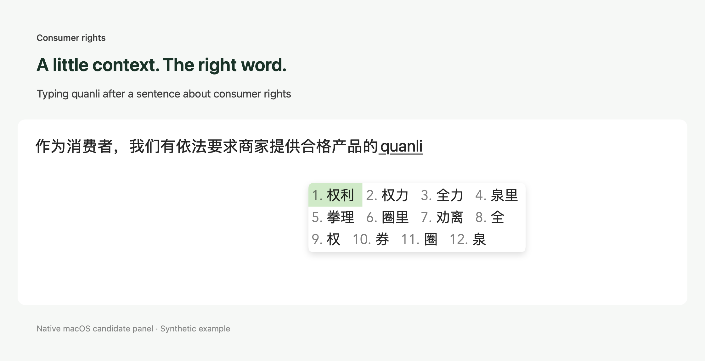

# Project Telepathy


**Chinese typing with a little more context.**

Telepathy is a native Chinese input method for macOS. Type pinyin as usual, and a small local model uses what you've already written to help put the right words first. Everything runs on your Mac—no account or API key required.

[Download the latest release](https://github.com/timothyzhutr/Project-Telepathy/releases/latest) · [User guide](https://github.com/timothyzhutr/Project-Telepathy/blob/main/docs/user-guide.md) · [Report an issue](https://github.com/timothyzhutr/Project-Telepathy/issues)

Telepathy is in early access. It currently supports **Apple Silicon Macs running macOS 26.2 or later**.



## Features

- **Context-aware candidates.** Kev ranks Chinese words and phrases using the text before your cursor. Rime and 万象 provide the pinyin conversion and dictionaries.
- **Native typing.** Use Telepathy in your Mac apps, with normal pinyin composition, keyboard selection and a native candidate panel.
- **Chinese and English together.** Optional Auto mode uses context to keep English literal and convert Chinese pinyin. This feature is experimental.
- **Automatic punctuation forms.** In Auto mode, commas, quotes and other marks follow the language of the sentence.
- **Make it yours.** Adjust candidates per row, text size, appearance, annotations and timing indicators in Settings.
- **Try a different ranker.** Experimental Context prediction scores which candidate naturally follows your text, using the same local model.
- **Local inference.** After the model download, typing assistance works offline. Your writing is not sent to a cloud service.

## Install

You do not need to install Python, Homebrew or any build tools.

1. Download and extract the macOS ZIP from [Releases](https://github.com/timothyzhutr/Project-Telepathy/releases/latest).
2. Run **Install Telepathy.command**, keeping it beside **Telepathy.app**.
3. Add **Telepathy** in **System Settings → Keyboard → Text Input → Edit → +**, then select it from the input-source menu. If it does not appear yet, log out and back in.
4. Run **Download Kev Model.command** to install the model. Alternatively:

   ```bash
   "$HOME/Library/Input Methods/Telepathy.app/Contents/MacOS/Telepathy" --download-model
   ```

The model download needs approximately **1.8 GB of disk space**, in addition to the app. Pinyin typing works while the model is downloading or loading. The installer backs up an existing Telepathy installation before replacing it.

The release is ad-hoc signed and has not been notarized by Apple. If macOS blocks it, use **System Settings → Privacy & Security → Open Anyway** after trying to open the package. See [troubleshooting](https://github.com/timothyzhutr/Project-Telepathy/blob/main/docs/troubleshooting.md) for installation help.

## Start typing

Select Telepathy and type pinyin normally.

| Action | Key |
| --- | --- |
| Choose the highlighted candidate | Space |
| Choose a numbered candidate | Its number key |
| Browse candidates | Arrow keys |
| Use literal English manually | Caps Lock |

Open **Telepathy → Settings…** from the input-source menu to change the candidate layout, try **Context prediction**, or enable **Automatic Chinese / English**. Kev remains the default ranking method. You can also switch Kev assistance on or off from the menu. With assistance off, Rime's regular candidates remain available and the model helper stops to free memory.

Auto mode keeps confident English input literal and gives Chinese or uncertain input the usual candidate choices. Press **↓ or Tab** to bring back Chinese choices for the current word, or **Shift + a letter** to start literal English until the next space. Short words and limited context can still be ambiguous.

See the [user guide](https://github.com/timothyzhutr/Project-Telepathy/blob/main/docs/user-guide.md) for all settings, punctuation behavior and keyboard details.

## Privacy and resources

Typing context is processed locally. Telepathy does not send it to a cloud API or write it to the worker log. Personal dictionary learning is currently disabled. The setup command downloads checksum-verified model files; inference then runs offline.

Kev runs on the Apple GPU through MLX, with **MXFP8 weights by default** to reduce memory use. Backbone weights occupy about **0.78 GB**; total memory usage is higher because of caches, the inference runtime and other model components. Turning assistance off stops the helper and releases its memory. Turning it back on reloads the model while ordinary pinyin typing remains available. Candidates appear immediately while model decisions run asynchronously.

Some apps expose less surrounding text than others, which can reduce contextual accuracy. [Resource and prediction details](https://github.com/timothyzhutr/Project-Telepathy/blob/main/experiments/prediction/README.md) include measurements and known limitations.

## Development

Want to build from source or contribute? Start with the [build guide](https://github.com/timothyzhutr/Project-Telepathy/blob/main/docs/development.md). Bugs, compatibility reports and focused pull requests are welcome. For a bug report, include your macOS version, the affected app and steps to reproduce; use a short example you're comfortable sharing.

## Credits and license

Telepathy builds on **鼠须管 / Squirrel, Rime, 万象, RIME-LMDG, Kev, Qwen, MLX** and the Python ecosystem. Their work makes this project possible. See [CREDITS.md](CREDITS.md) for component attribution and upstream links; the app also includes a native Credits and Licenses window.

Telepathy's application and integration code are licensed under [GPL-3.0](LICENSE). Dependencies and model weights retain their own licenses. Model weights are downloaded separately and are not included in the app or repository.
